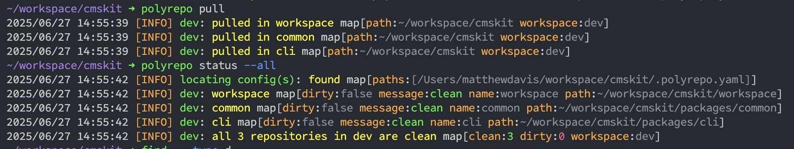

# Development Workspace

## Setup

### Install or update the `polyrepo` CLI

```bash
go install github.com/polyrepopro/polyrepo@latest
```

### Initialize the workspace

```bash
poly init --path ~/.polyrepo.yaml --url https://raw.githubusercontent.com/cmskitdev/workspace/refs/heads/main/.polyrepo.yaml 
```

This will pull down the remote `.polyrepo.yaml` and place it at `~/.polyrepo.yaml`.

## Usage

These are the basic commands you will use to work with the workspace:

| Step | Command                           | Description                     |
| ---- | --------------------------------- | ------------------------------- |
| 1    | `polyrepo init`                   | Initialize the workspace. |
| 2    | `polyrepo pull`                   | Pull changes from all repos.    |
| 3    | `polyrepo commit --message <msg>` | Commit changes to all repos.    |
| 4    | `polyrepo push`                   | Push changes to all repos.      |
| 5    | `polyrepo status --all`           | Check the status of all repos.  |

> To get all the commands for a repo see the [polyrepo documentation](https://github.com/polyrepopro/polyrepo) or run `polyrepo help`.

### First Time Setup

```sh
polyrepo init --path ~/workspace/cmskit/.polyrepo.yaml --url https://raw.githubusercontent.com/cmskitdev/workspace/refs/heads/main/.polyrepo.yaml
polyrepo pull 
polyrepo status --all
```



### Ship Changes

```sh
polyrepo commit --message "feat: add new feature"
polyrepo push
```

### Checking Status

You can check the status of all repos with the `status` command:

```sh
polyrepo status --all
```

This will show you the status of all repos in the workspace:

```sh
2025/06/27 14:59:28 [INFO] locating config(s): found map[paths:[/Users/matthewdavis/workspace/cmskit/.polyrepo.yaml]]
2025/06/27 14:59:28 [INFO] dev: workspace map[dirty:false message:clean name:workspace path:~/workspace/cmskit/workspace]
2025/06/27 14:59:28 [INFO] dev: common map[dirty:false message:clean name:common path:~/workspace/cmskit/packages/common]
2025/06/27 14:59:28 [INFO] dev: cli map[dirty:false message:clean name:cli path:~/workspace/cmskit/packages/cli]
2025/06/27 14:59:28 [INFO] dev: all 3 repositories in dev are clean map[clean:3 dirty:0 workspace:dev]
```

## See Also

- <https://github.com/polyrepopro/polyrepo>
